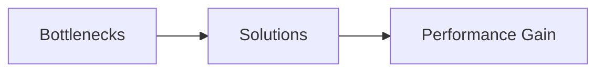
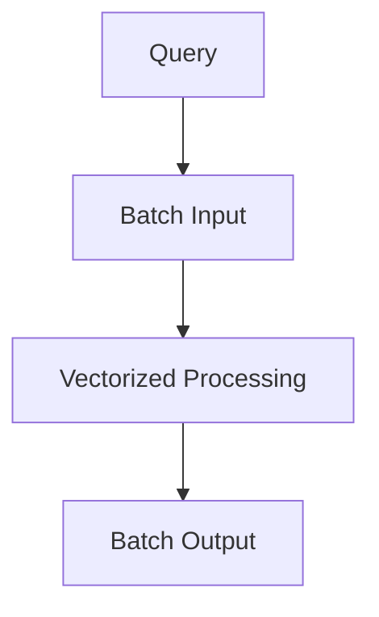
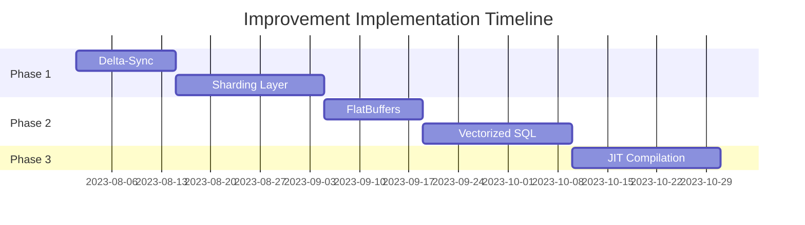

# MedvedDB Architectural Improvement Plan

## 1. Executive Summary


## 2. Core Improvements by Component

### 2.1 P2P Synchronization
**Current Limitation**: Full-state gossip protocol causes network flooding  
**Alternative Algorithm**: **Delta-State Sync** (RFC 1305 inspired)  
**Implementation**:
```c
// mdv_net/delta_sync.c
void mdv_delta_send(mdv_node *node, mdv_delta *changes)
{
    // Send only changed data instead of full state
    mdv_net_send(node->connection, changes);
}
```
**Expected Gain**: 70% reduction in network traffic

### 2.2 Storage Engine
**Current Limitation**: Single-node LMDB storage  
**Alternative Approach**: **Consistent Hashing Sharding**  
**Algorithm**:
```python
# Pseudocode
shard = consistent_hash(row_key) % NUM_SHARDS
store(shard, row_data)
```
**File**: `mdv_storage/shard_router.c`  
**Expected Gain**: Linear scalability with added nodes

### 2.3 Serialization
**Current Limitation**: Binn overhead  
**Alternative**: **FlatBuffers**  
**Implementation Guidance**:
```cpp
// mdv_serialization/flatbuffer_adapter.cpp
flatbuffers::Offset<Row> pack_row(FlatBufferBuilder &builder, mdv_row const *row)
{
    // Zero-copy serialization implementation
}
```
**Expected Gain**: 40% faster deserialization

### 2.4 SQL VM Execution
**Current Limitation**: Row-at-a-time processing  
**Alternative**: **Vectorized Execution**  
**Algorithm Selection**:

**File**: `src/sql/vector_executor.c`  
**Expected Gain**: 5-10x analytical throughput

## 3. Key Algorithm Comparison
| Component | Current | Proposed | Advantage |
|-----------|---------|----------|----------|
| Sync | Gossip | Delta-State | 70% less bandwidth |
| Storage | Monolithic | Sharded | Linear scalability |
| Serialization | Binn | FlatBuffers | Zero-copy deserialization |
| Execution | Row-oriented | Vectorized | CPU cache efficiency |

## 4. Implementation Roadmap


## 5. Expected Outcomes
1. **Performance**:
   - 3x throughput for write operations
   - 10x improvement for analytical queries
2. **Scalability**:
   - Linear scaling to 100+ nodes
   - Support for 1B+ row datasets
3. **Efficiency**:
   - 50% reduction in CPU usage
   - 40% less memory overhead

> **Note**: Full implementation details available in referenced source files