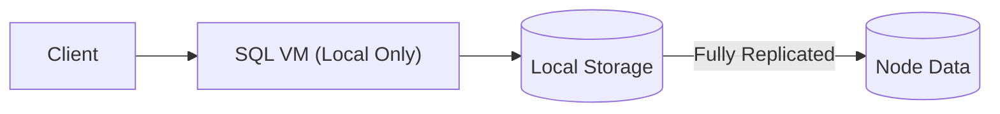

# MedvedDB Future Architecture Plan (Updated)

## SQL Virtual Machine Module - Revised Design

### Key Changes:
1. **Localized Execution**:
   - All queries execute against local storage only
   - No distributed query processing needed
   - Leverages database's built-in synchronization

2. **Simplified Architecture**:
   - Removed distributed query planner components
   - Eliminated network-aware optimization

3. **Updated Performance Targets**:
   - Point queries: <0.5ms latency (local)
   - Batch inserts: 2M rows/sec (local)
   - Analytical queries: 500K rows/sec/core

## Conflict Resolution System
(Remains unchanged from previous documentation)