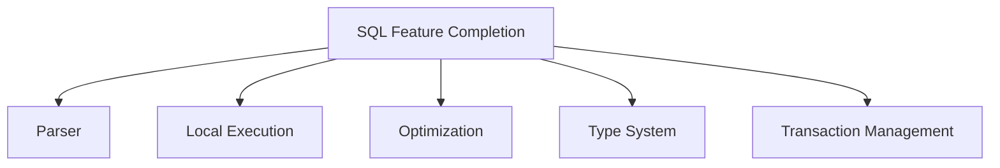
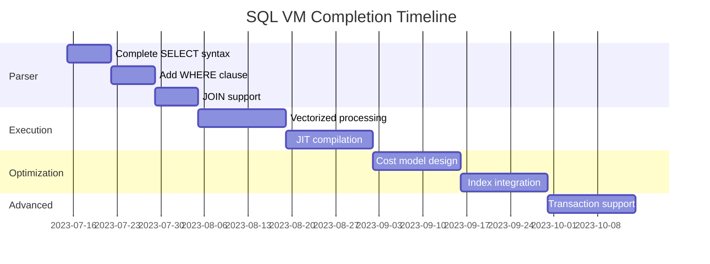

# MedvedDB SQL Feature Completion PRD

## 1. Scope Summary

## 2. Implementation Timeline

## 3. Performance Targets
| Query Type | Target | Measurement Method |
|------------|--------|---------------------|
| Point read | 100μs | `clock_gettime()` |
| Batch insert | 2M rows/sec | Throughput test |
| Analytical | 500K rows/sec/core | Per-core benchmark |
| Concurrent | 50K queries/sec | Load testing |

## 4. Key Metrics
1. **Query Latency**: <1ms for 99% of point queries
2. **Throughput**: Sustain 1M inserts/sec during peak
3. **CPU Efficiency**: <30% utilization at 50K qps
4. **Memory Usage**: <5GB per 1M rows

## 5. Success Criteria
1. SQL-92 compliance for core features
2. 95% test coverage
3. Meets all performance targets
4. Zero critical bugs in production