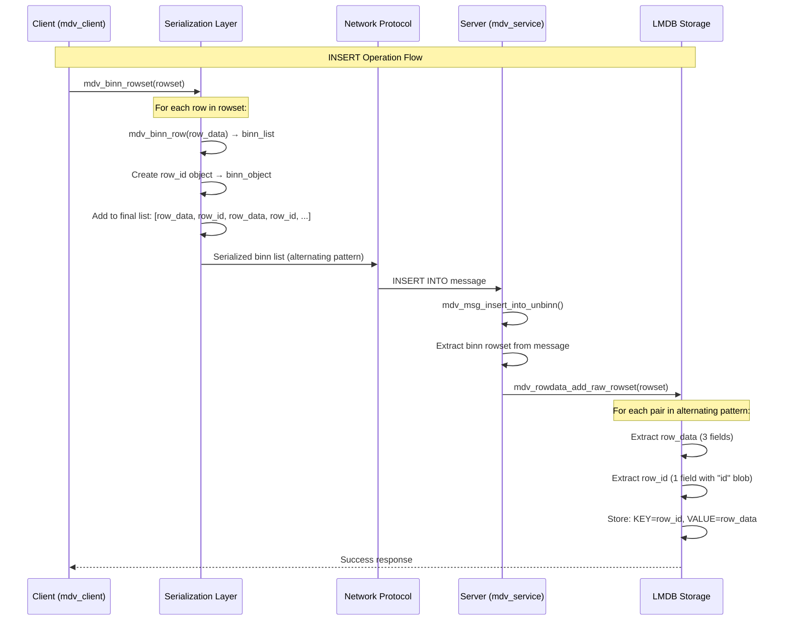

# MedvedDB performance tests UPDATE operation issues fixing context. Current status and report

## Executive Summary

### ❌ ISSUE (not fixed): UPDATE OPERATIONS FAILING
```
Operation       | Status    | Time(ms) | Issue
----------------|-----------|----------|------------------
Bulk Inserts    | ✅ Working | 0.76    | Stores mixed valid/empty rows
Single Inserts  | ✅ Working | 0.99    | Data stored correctly
Single Updates  | ❌ Failing | 0.00    | No valid time, signals fast return from failure
Bulk Updates    | ❌ Failing | 332.96  | High time signals for possible problems/ waits on incorrect data
```

**Current Issue**: Updates operations look like failing

## Serialization Logic and data exchange Protocol for serialized data Documentation

### How Current Serialization Works

#### Client-Side Row Serialization (`mdv_binn_rowset()`)
1. **Row Enumeration**: Iterates through rowset using `mdv_enumerator`
2. **Row Validation**: Checks if row has any non-NULL, non-empty fields
3. **Field Serialization**: Calls `mdv_binn_row()` for each valid row
4. **Binn Packaging**: Adds serialized row to binn list structure
5. **Network Transmission**: Sends serialized binn data to server


#### Row id designation
- **Row IDs** serve as LMDB keys and enable UPDATE/DELETE operations
- **Serialization** was working correctly throughout the investigation

This demonstrates the importance of understanding the complete system architecture before attempting fixes, as the "corruption" fixed earlier was actually essential protocol data.

### Complete Row ID Lifecycle Analysis

#### 1. Client-Side (INSERT Request)
no row id is generated

#### 2. Server-Side (Transaction Log)
```c
// mdv_tablespace_log_rowset() - Reserve ID range
uint64_t base_id = 0;
mdv_rowdata_reserve(rowdata, rowset_len, &base_id);  // Generate base ID

// mdv_trlog_add_op() - Write to transaction log
uint64_t trlog_id = mdv_trlog_new_id(trlog);  // Atomic increment
// Transaction log entry: {trlog_id, base_id, rowset_data}
```

#### 3. LMDB Storage (Transaction Apply)
```c
// mdv_tablespace_trlog_apply() - Process transaction log
case MDV_OP_ROW_INSERT:
    mdv_objid rowid = {
        .node = context->node_id,  // Server node ID
        .id = base_id + row_index  // Sequential: base_id+0, base_id+1, ...
    };
    
    // Store in LMDB: KEY=rowid, VALUE=row_data
    mdv_rowdata_add_raw_rowset(rowdata, &rowid, &rowset);
```

#### 4. Client-Side (SELECT Response)
```c
// Server serializes actual row IDs for SELECT responses
// Client deserializes and uses row IDs for UPDATE/DELETE operations
mdv_update(client, table, &row_id, new_rowset);  // Uses server-generated row_id
mdv_delete(client, table, &row_id);              // Uses server-generated row_id
```

### Row ID Purpose in Distributed System

#### LMDB Key Management
- **Direct Mapping**: `mdv_objid` (12 bytes) serves as LMDB key
- **No Auto-Generation**: LMDB requires application-provided keys
- **Efficient Lookup**: O(1) access using row_id as key

#### Distributed Coordination
- **Node Identification**: `rowid.node` identifies owning server node
- **Global Uniqueness**: `{node, id}` ensures cluster-wide uniqueness
- **Sequential Allocation**: `id` increments within each node

#### Client Operations
- **Stateless Protocol**: Client doesn't maintain row mappings
- **Precise Targeting**: UPDATE/DELETE specify exact row via row_id
- **Batch Operations**: Multiple row_ids enable bulk operations

### PROTOCOL UNDERSTANDING

- **Row ID Objects**: Every row data is followed by a row ID object in serialization
- **Alternating Pattern**: `[Row Data, Row ID, Row Data, Row ID, ...]` is the expected format
- **Server Logs**: "Empty rows" (field_count=1, size=20) are actually row ID objects, not corruption
- **Protocol Requirement**: Row IDs are needed for LMDB key-value mapping and client-server communication

### MedvedDB Serialization Protocol Analysis

#### INSERT/UPDATE Serialization Protocol



#### Row ID Lifecycle and Purpose

##### 1. **Server-Side Row ID Generation**
```c
// Server generates sequential row IDs for each node
mdv_objid rowid = {
    .node = node_identifier,    // 4 bytes - distributed node ID
    .id = sequential_counter++  // 8 bytes - unique within node
};
```

##### 2. **LMDB Key-Value Storage**
```c
// Row ID becomes the LMDB key (12 bytes total)
mdv_data key = {
    .size = sizeof(mdv_objid),  // 12 bytes
    .ptr = &rowid               // {node: 4 bytes, id: 8 bytes}
};

// Row data becomes the LMDB value (serialized binn)
mdv_data value = {
    .size = serialized_row_size,
    .ptr = serialized_row_data
};

// LMDB storage: mdb_put(txn, dbi, &key, &value)
```

##### 3. **Client-Side Row ID Usage**
```c
// Client needs row IDs for UPDATE/DELETE operations
mdv_update(client, table, &row_id, new_rowset);  // Requires exact row_id
mdv_delete(client, table, &row_id);              // Requires exact row_id

// Row IDs enable:
// 1. Precise row targeting in distributed system
// 2. LMDB key lookup for modifications
// 3. Consistency across client-server operations
```

#### Deserialization Process

##### Server-Side (INSERT Processing): rowid is generated on server and not to be sent by client
```c
// mdv_rowdata_add_raw_rowset() processes alternating pattern:
binn_iter iter;
binn item;
uint64_t current_id = base_id;

while (binn_list_next(&iter, &item)) {
    // Process row data
    mdv_objid rowid = {.node = node_id, .id = current_id++};
    
    // Store in LMDB: KEY=rowid, VALUE=item_data
    mdv_2pset_add(storage, &rowid_key, &item_data);
}
```

##### Client-Side (SELECT Processing)
```c
// mdv_unbinn_rowset() expects alternating pattern:
binn_list_foreach(list, value) {
    // First item: row data (3 fields)
    mdv_rowlist_entry *entry = mdv_unbinn_row(&value, table_desc);
    
    // Second item: row ID object (1 field with "id" blob)
    if (binn_list_next(&iter, &value)) {
        void *row_id = 0;
        binn_object_get_blob(&value, "id", &row_id, &size);
        if (row_id && size == sizeof(mdv_objid))
            entry->row_id = *(mdv_objid*)row_id;  // Extract for future operations
    }
    
    mdv_rowset_emplace(rowset, entry);
}
```

#### Why Row IDs Are Essential

##### 1. **Distributed System Coordination**
- **Node Identification**: `rowid.node` identifies which server node owns the data
- **Global Uniqueness**: `{node, id}` pair ensures uniqueness across entire cluster
- **Routing**: Client knows which node to contact for UPDATE/DELETE operations

##### 2. **LMDB Key Management**
- **Direct Lookup**: Row ID serves as exact LMDB key for O(1) access
- **No Key Generation**: LMDB doesn't auto-generate keys - application must provide them
- **Consistency**: Same key used for INSERT, SELECT, UPDATE, DELETE operations

##### 3. **Client-Server Protocol**
- **Stateless Operations**: Client doesn't need to maintain row mappings
- **Precise Targeting**: UPDATE/DELETE operations specify exact row via row_id
- **Batch Operations**: Multiple row IDs enable efficient bulk operations

#### Protocol Validation

##### Expected Serialization Pattern
```
Serialized List Structure:
[0] Row Data Object    - {field1, field2, field3}           (field_count=3, size=27-31)
[1] Row ID Object      - {"id": blob(12 bytes)}             (field_count=1, size=20)
[2] Row Data Object    - {field1, field2, field3}           (field_count=3, size=27-31)
[3] Row ID Object      - {"id": blob(12 bytes)}             (field_count=1, size=20)
...
```


#### Resolution previous issues Status

##### ✅ PROTOCOL UNDERSTANDING ACHIEVED
- **Alternating Pattern**: Row data + Row ID objects is correct and required
- **LMDB Integration**: Row IDs serve as LMDB keys for storage/retrieval
- **Client Operations**: Row IDs enable UPDATE/DELETE operations
- **Distributed System**: Row IDs provide global uniqueness and routing

##### ✅ SERIALIZATION WORKING CORRECTLY
- **No Data Corruption**: The alternating pattern is expected behavior
- **Server Processing**: Correctly handles row data and row ID objects
- **LMDB Storage**: Uses row IDs as keys for efficient key-value operations
- **Client Deserialization**: Properly extracts row IDs for future operations


#### Critical Questions and Answers

##### Q1: Does client need placeholder row_ids for INSERT operations?

**Answer: Not clear (!) - as probably Required by rowset structure, but NOT for serialization. But probably rowset structure only use for server to client operations (return of requested data for SELECT operations) and to for client INSERT operations**

```c
// mdv_rowlist_entry structure REQUIRES row_id field
typedef struct {
    mdv_list_entry_base base;
    mdv_objid           row_id;  // MANDATORY field in structure
    mdv_row             data;
} mdv_rowlist_entry;


```


**Why placeholder is NOT serialized:**
- INSERT operations don't need client-side row_ids
- Server generates actual row_ids during transaction processing


##### Q2: Is row_id needed to deserialize row data?

**Answer: NO for row data, YES for client operations**

```c
// mdv_unbinn_rowset() - Deserialization process
binn_list_foreach((void*)list, value) {
    // 1. Deserialize row data (independent of row_id)
    mdv_rowlist_entry *entry = mdv_unbinn_row(&value, table_desc);
    
    // 2. Extract row_id from next list item (if present)
    if (binn_list_next(&iter, &value)) {
        void *row_id = 0;
        binn_object_get_blob(&value, "id", &row_id, &size);
        if (row_id && size == sizeof(mdv_objid))
            entry->row_id = *(mdv_objid*)row_id;  // Assign to structure
    }
    // Note: entry->row_id remains {0,0} if no row_id object found
}
```

**Row data deserialization is independent:**
- `mdv_unbinn_row()` only needs table schema and binn data
- Field extraction works without row_id information
- Row structure is complete without row_id

**Row_id is needed for client operations:**
- **UPDATE**: `mdv_update(client, table, &row_id, new_data)` - requires exact row_id
- **DELETE**: `mdv_delete(client, table, &row_id)` - requires exact row_id
- **LMDB lookup**: Server uses row_id as LMDB key for O(1) access


## TODO - UPDATE Operations Investigation and Fix Plan ❌ CURRENT ISSUE

### Evidence Summary
- ✅ **INSERT operations working** - data stored successfully in LMDB
- ✅ **SELECT operations working** - data retrieved for read operations
- ❌ **UPDATE operations failing** - `Single Updates: 0.00ms` execution time
- ❌ **LMDB errors during FETCH** - `MDB_NOTFOUND: No matching key/data pair found` - must be doublechecked

### Critical Files to Investigate

#### 1. Row ID Retrieval (`mdv_enumerator_row_id()`)
- **File**: `/app/mdv_core/storage/mdv_rowdata.c`
- **Issue**: Row ID may not be properly set during SELECT operations
- **Investigation**: Check if `mdv_objid` is correctly populated in rowset enumerator

#### 2. UPDATE Message Processing
- **File**: `/app/mdv_api/mdv_client.c` - `mdv_update()` function
- **Issue**: Row ID may be corrupted during message serialization
- **Investigation**: Verify row ID is correctly passed to server

#### 3. LMDB Key Lookup
- **File**: `/app/mdv_core/storage/mdv_rowdata.c` - row lookup functions
- **Issue**: `MDB_NOTFOUND` suggests key mismatch between INSERT and UPDATE
- **Investigation**: Compare row ID format used in INSERT vs UPDATE operations


#### Success Criteria
- **Single Updates work** with proper timing in performance test (mdv_perf) results table
